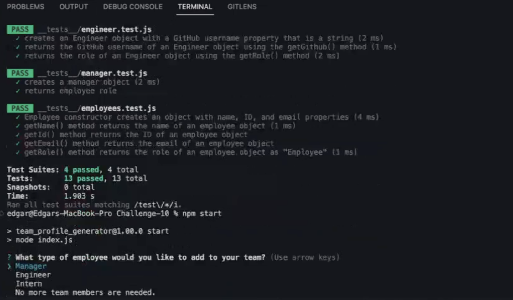
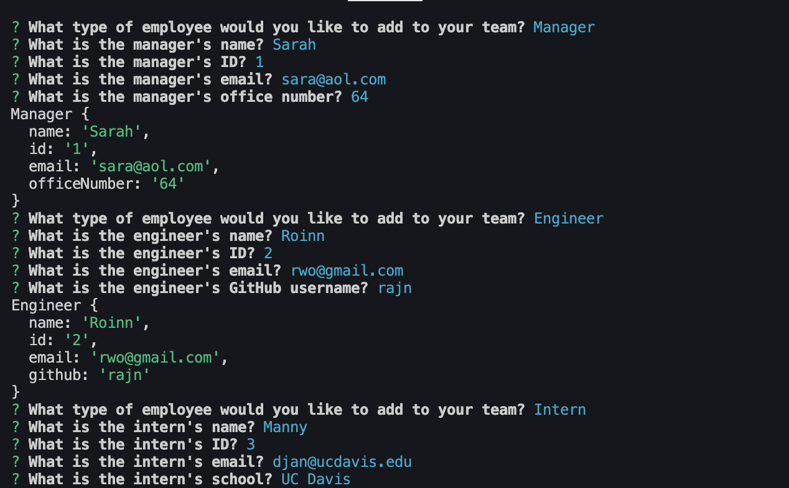
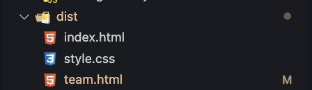
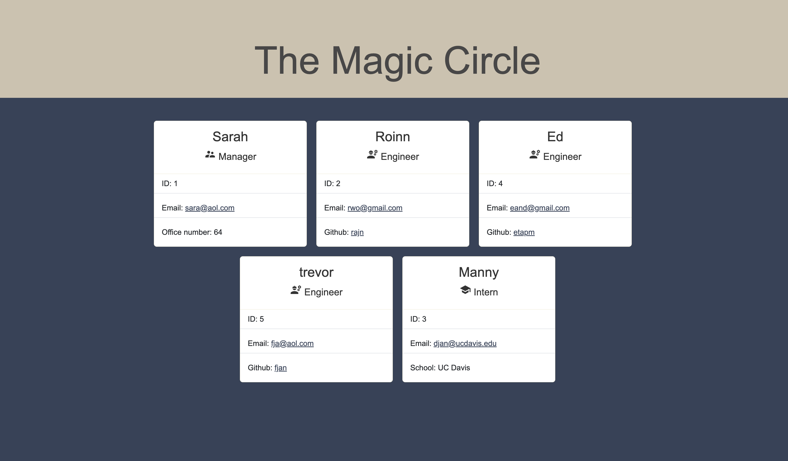

# Team Profile Generator

This project uses the following technologies:

- CSS
- Bootstrap
- JavaScript
- Node.js
- Inquirer
- Jest

## Description

This is a Node.js program that makes a webpage for an entire team of developers. It shows each person's summary and makes it easy for the user to get in touch with them through their name, ID, and email. The program has three categories for employees: manager, engineer, and intern, and asks different questions depending on the category.

## Table of Contents

- [Installation](#installation)
- [Usage](#usage)
- [Credits](#credits)
- [Tests](#tests)

## Installation

To run this project, you need to have Node.js installed on your machine. After [cloning the repository](https://docs.github.com/en/repositories/creating-and-managing-repositories/cloning-a-repository), run the following command `"npm install"` or `"npm i"` to install the dependencies.

`1. git clone git@github.com:etapm/Team_Profile_Generator.git`

`2. "npm install" or "npm i"`

Review the code on the GitHub repository by visiting the [GitHub Repository](https://github.com/etapm/Team_Profile_Generator). Be sure to also check out the [Walkthrough Video](https://drive.google.com/file/d/1qUtSrE2RrPr-huVbY_xdUNAorQ28UVC3/view) to see the README generator in action.

## Usage

After you install everything, open the terminal and type `"node index.js"` or `"node start"`. Then answer the questions about your employees. When you're done, select 'No more team members are needed' and your team will be ready to view in the team.html file.

1. Through your command line, head towards the root directory of your project and run the following command:
   node index.js

   

2. Answer the prompts to provide information about your project.

   

3. Once prompts are answered, a team.html file will be generated for your project.

   

4. Open the team.html file in your browser to view your team.

   

## Credits

N/A

## License

N/A

## Badges

N/A

## Features

N/A

## How to Contribute

N/A

## Tests

This project uses Jest for testing, execute the code line `"npm test"` or `"npm run test"` in the terminal, which will display four test pages and confirm that all 13 tests have successfully passed.
